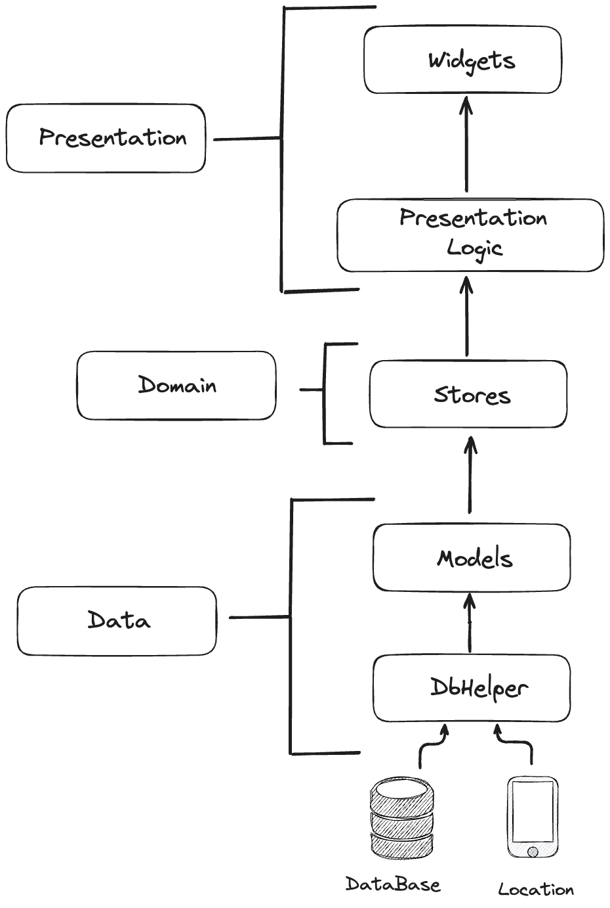

# Prueba técnica Inter Rapidisimo
## Prueba técnica Flutter developer - Inter Rapidisimo

Proyecto realizado para la prueba técnica en Inter Rapidisimo, el proyecto consiste en la creación de ubicaciones y asignación de ubicaciones a usuarios, todo esto almacenandolo de manera local en una BD, para el proyecto utilice el gestor de estados [MobX](https://pub.dev/packages/mobx) y de base de datos utilice [Sqflite](https://pub.dev/packages/sqflite).💻

## Características
El proyecto se compone principalmente por 2 features principales:
- Location (Ubicaciones): Las ubicaciones que se pueden crear y asignar.
- Friend (Amigos/usuarios): Lista de amigos por defecto al instalar el app vienen ya agregados 5 amigos.


## Arquitectura
Arquitectura utilizada en el app:



## Instalación
Para la instalación del proyecto debemos tener en cuenta las versiones de [Flutter](https://flutter.dev/).
Importante instalar la depedencia de build_runner para generar los store.

Clonar el repositorio:

```sh
git clone https://github.com/Sebastian-Beltran/prueba_interrapidisimo.git
```

Navegar al directorio del proyecto:

```sh
cd prueba_interrapidisimo
```

Instalar dependencias:

```sh
flutter pub get
```

Importante tambien generar los store con el comando:

```sh
dart run build_runner build —delete-conflicting-outputs
```

Para correr el proyecto se debe correr el siguiente comando:

```sh
flutter run
```

## Testing
El proyecto cuenta con widget testing, con el siguiente comando:

```sh
flutter test
```

## Tecnologías Usadas
- [Flutter](https://flutter.dev/) - Framework de desarrollo.
- [Dart](https://dart.dev/) - Lenguaje de programación.
- [MobX](https://pub.dev/packages/mobx) - Gestor de estados.
- [Sqflite](https://pub.dev/packages/sqflite) - Base de datos local.

## Autor
- **Sebastian Beltran Gonzalez** - [GitHub](https://github.com/Sebastian-Beltran)
